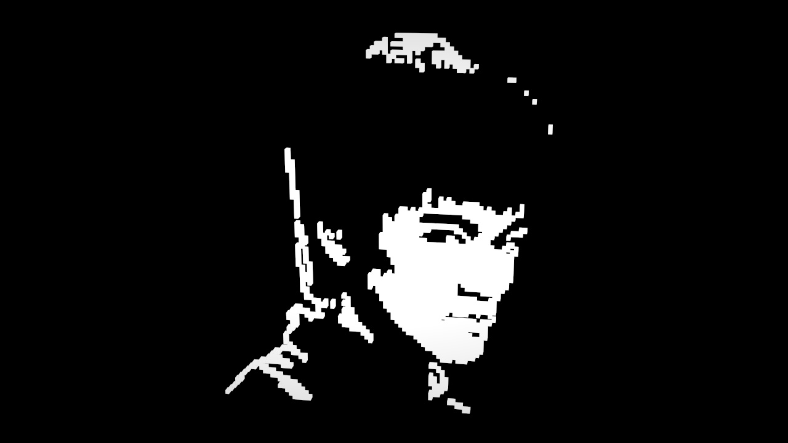
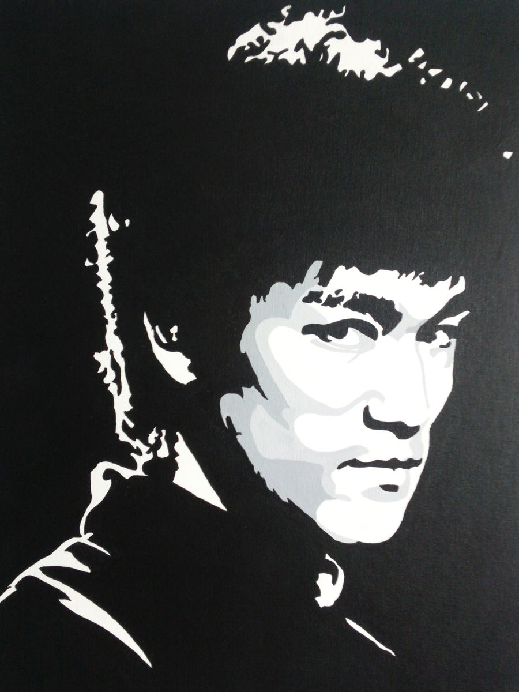

# [Bruce Lee](https://bruceleefoundation.org/about-bruce-lee/)

## Tao of Jeet Kune Do

</img>

Inspired from Jennifer Stafford’s knitting chart for [Bruce Lee](http://www.domiknitrix.com/knittingpatterns/brucelee_knittingpattern.cfm).

The original photo was first used on the cover of "Tao of Jeet Kune Do".

</img>

## The Dragon

</img>

Inspired from Yankoo’s [pixel art](https://www.youtube.com/watch?v=X3swPaJa-mU) in Minecraft.

Probably from a movie. I'm not sure.

</img>

