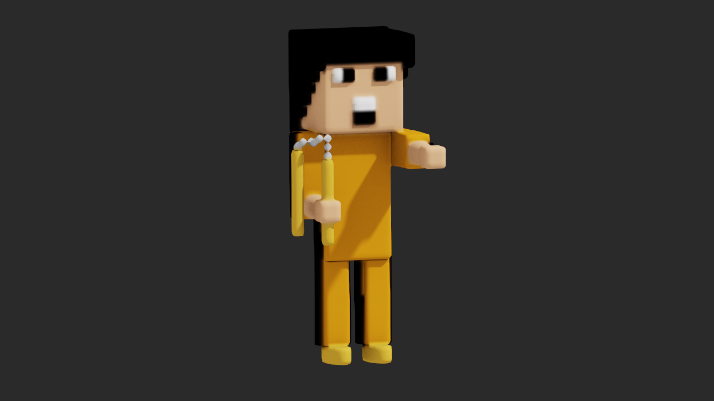
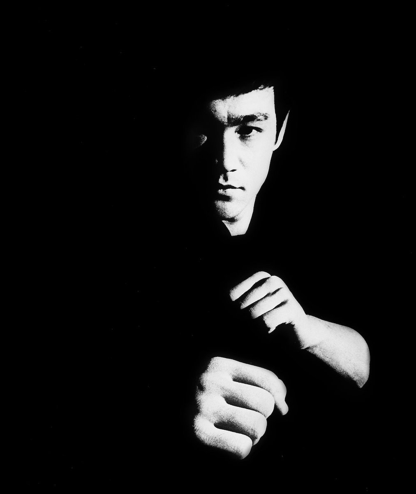

# [Bruce Lee](https://bruceleefoundation.org/about-bruce-lee/)

## Voxel Arts

| Model | Taichi |
| :-----------------: | :------------: |
|       |  |

I used the [@maajor's method](https://github.com/maajor/maajor-voxel-challenge). [@maajor](https://github.com/maajor) is author of the famous voxel artwork "The Girl with a Voxel Earring".

## Pixel Arts

| Tao of Jeet Kune Do |     Movie      |
| :-----------------: | :------------: |
|       |  |

### Tao of Jeet Kune Do

Inspired from Jennifer Stafford’s knitting chart for [Bruce Lee](http://www.domiknitrix.com/knittingpatterns/brucelee_knittingpattern.cfm).

The original photo is best known for being used on the cover of "Tao of Jeet Kune Do". This book is about his martial arts and philosophy.

  

### Movie

Inspired from Yankoo’s [pixel art](https://www.youtube.com/watch?v=X3swPaJa-mU) in Minecraft.

The original photo probably from a movie. I'm not sure.

  

